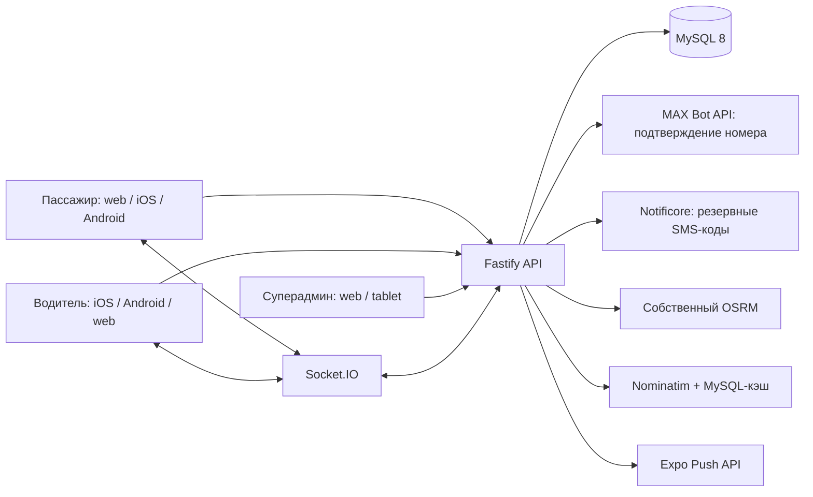

# Архитектура «Такси Грахово»

## Контуры

Один Expo Router‑клиент используется на web, iOS и Android. Дизайн‑токены находятся в `src/theme/tokens.ts`, базовые элементы — в `src/components/ui`, а ролевые экраны не дублируют визуальную систему.

## Роли

- `passenger`: поиск адреса, расчёт, заказ, отмена, история, заявка водителя;
- `driver`: статус линии, предложения, принятие, этапы поездки, геолокация, заработок;
- `admin`: все заказы, заявки, водители, индивидуальная комиссия, глобальные тарифы и аудит.

Роль приходит только из подписанной сервером JWT. Клиентские guard‑экраны улучшают UX, но не являются контролем доступа: каждый API endpoint повторно проверяет роль.

## Жизненный цикл заказа

`searching → accepted → driver_arriving → driver_waiting → in_progress → completed`

Отмена разрешена только до начала поездки. Принятие выполняется в транзакции с `SELECT ... FOR UPDATE`, поэтому два водителя не могут получить один заказ. Идемпотентный ключ защищает от двойного создания при повторе мобильного запроса.

## Деньги

Суммы хранятся в копейках как целые числа. Маршрут и цена повторно рассчитываются сервером. Комиссия назначается при принятии заказа: индивидуальная ставка водителя имеет приоритет над общей. Ставка и сумма комиссии сохраняются в заказе и не меняются задним числом.

## Безопасность

- SMS-код привязан к challenge и телефону, имеет TTL и не более пяти попыток;
- согласия фиксируются только после успешной проверки одноразового кода;
- JWT подписан HS256, имеет issuer/audience и срок 30 дней;
- секреты не имеют префикса `EXPO_PUBLIC_`;
- CORS — allowlist, rate limit — 120 запросов/мин на IP;
- административные изменения пишутся в `audit_logs`;
- SQL параметризован, входные данные проверяются Zod;
- session token хранится в SecureStore на iOS/Android.

## Карты

Ключ JavaScript API Яндекса используется только для отображения карты и должен
быть ограничен доменом и package/bundle ID. Маршруты рассчитывает собственный
OSRM по данным OpenStreetMap. Поиск адресов проходит через локальный справочник
и Nominatim с кэшем, лимитом один запрос в секунду и явным действием
пользователя. Если OSRM временно недоступен, сервер использует консервативную
геометрическую оценку и не блокирует создание заказа.
